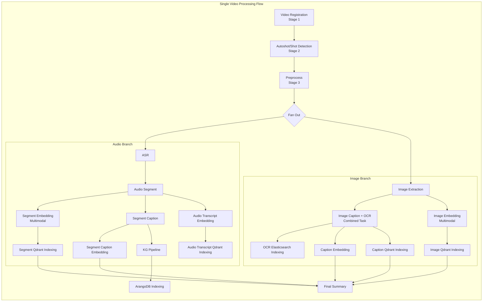

# CLAUDE.md

This file provides guidance to Claude Code (claude.ai/code) when working with code in this repository.

## Project Overview

This is a **Prefect-based video processing pipeline** that extracts, analyzes, and indexes video content for semantic search. The system processes uploaded videos through multiple stages: scene detection, audio transcription, frame extraction, captioning, embedding generation, knowledge graph construction, and vector indexing.

### Tech Stack

- **Python 3.12+** with Pydantic v2 for data validation
- **Prefect 3.x** for workflow orchestration with DaskTaskRunner for parallelism
- **FastAPI** for the REST API layer
- **PostgreSQL** for artifact metadata and lineage tracking
- **MinIO** (S3-compatible) for object storage (videos, images, artifacts)
- **Qdrant** for vector search and embedding storage
- **Elasticsearch** for OCR text indexing and search (BM25 + kNN hybrid)
- **ArangoDB** for Knowledge Graph storage and graph queries
- **Triton Inference Server** for SPLADE sparse embeddings
- **Redis** for Prefect messaging
- **External ML Services**: QwenVL (embeddings), mmBERT (text embeddings), ASR, LLM providers (OpenRouter, Gemini)

## Commands

### Development Setup

```bash
# Install with uv (recommended)
uv sync --extra worker

# Or with pip
pip install -e ".[worker]"
```

### Running Services

```bash
# Start all infrastructure (Prefect, Postgres, Redis, MinIO, Qdrant, ArangoDB, Elasticsearch)
cd docker && docker-compose up -d

# Run the API server
video-pipeline-api
# Or directly:
uvicorn video_pipeline.api.app:app --host 0.0.0.0 --port 8050

# Run Prefect worker (after infrastructure is up)
prefect worker start --pool local-pool
```

### Linting and Testing

```bash
# Lint with ruff
ruff check src/
ruff format src/

# Run tests
pytest tests/
pytest tests/test_specific.py -v  # Single file with verbose output
```

## Architecture Overview

### Directory Structure

```
src/video_pipeline/
├── api/                    # FastAPI application
│   ├── app.py             # Main FastAPI app with CORS, routers
│   ├── lifespan.py        # Startup/shutdown lifecycle
│   ├── routers/           # API endpoints
│   │   ├── health.py      # Health check endpoints
│   │   ├── upload.py      # Video upload/submission endpoint
│   │   └── videos.py      # Video retrieval and deletion endpoints
│   └── services/          # Business logic services
│       ├── deletion.py    # VideoDeletionService - deletes all artifacts
│       └── retrieval.py   # VideoRetrievalService - fetches all video data
├── config/                 # Configuration management
│   ├── settings.py        # Pydantic-settings based configuration
│   ├── tasks.yaml         # Task definitions with retries, timeouts, caching
│   └── environments/      # Environment-specific YAML configs (dev.yaml, etc.)
├── core/
│   ├── artifact/          # Pydantic models for pipeline outputs
│   ├── client/            # External service clients
│   │   ├── inference/     # ML service clients (ASR, OCR, Autoshot, Embeddings)
│   │   │   ├── asr_client.py       # Qwen3-ASR client
│   │   │   ├── autoshot_client.py  # Scene detection client
│   │   │   ├── ocr_client.py       # OCR extraction client
│   │   │   ├── qwenvl_embed.py     # QwenVL multimodal embeddings
│   │   │   ├── splade_client.py    # SPLADE sparse embeddings via Triton
│   │   │   └── te_client.py        # Text embedding client
│   │   ├── llm_provider/  # LLM clients (Gemini, OpenRouter, Moondream)
│   │   ├── progress/      # HTTP progress tracking
│   │   │   ├── http_tracker.py     # HTTPProgressTracker class
│   │   │   └── registry.py         # StageRegistry for stage names
│   │   └── storage/       # Storage clients (MinIO, Qdrant, PostgreSQL, ArangoDB, Elasticsearch)
│   │       ├── minio/              # MinIO object storage
│   │       ├── pg/                 # PostgreSQL client and schema
│   │       ├── qdrant/             # Qdrant vector database
│   │       ├── arango/             # ArangoDB graph database
│   │       └── elasticsearch/      # Elasticsearch OCR indexing
│   ├── storage/           # Persistence layer (pg_tracker, prefect_block)
│   └── state.py           # Shared state management
├── flow/                   # Prefect flow orchestration
│   ├── main.py            # Main single_video_processing_flow
│   ├── subtask.py         # Preprocessing tasks
│   └── batch_helper.py    # Batching utilities
└── task/                   # Individual processing tasks
    ├── base/              # BaseTask abstract class, cache_keys
    ├── video/             # Video registration
    ├── autoshot/          # Scene/shot detection
    ├── asr/               # Audio speech recognition
    ├── audio_segment/     # Audio segmentation into semantic chunks
    ├── audio_transcript_embedding/  # ASR text embeddings
    ├── image_extraction/  # Frame extraction
    ├── image_caption_ocr/ # Combined frame captioning + OCR (single LLM call)
    ├── image_embedding/   # Frame embeddings (multimodal)
    ├── image_caption_embedding/     # Caption text embeddings
    ├── ocr_indexing/      # OCR text indexing into Elasticsearch
    ├── segment_caption/   # Segment caption generation
    ├── segment_embedding/ # Segment embeddings (multimodal)
    ├── segment_caption_embedding/   # Segment caption text embeddings
    ├── kg_graph/          # Knowledge Graph pipeline (5 stages)
    ├── arango_indexing/   # Knowledge Graph indexing into ArangoDB
    └── qdrant_indexing/   # Vector database indexing
        ├── image.py       # Image embedding indexing
        ├── image_caption.py     # Image caption embedding indexing
        ├── segment.py     # Segment embedding indexing
        ├── segment_caption.py   # Segment caption embedding indexing
        ├── audio_transcript.py  # Audio transcript embedding indexing
        ├── config.py      # Shared Qdrant configuration
        └── utils.py       # Shared utilities
```

### Core Components

#### 1. Task System (`task/base/base_task.py`)

All tasks extend `BaseTask[InputT, OutputT]` and implement four methods:

```python
class MyTask(BaseTask[InputType, OutputType]):
    async def preprocess(self, input_data: InputT) -> Any:
        """Validate/transform input, load data, prepare batches."""
        pass

    async def execute(self, preprocessed: Any, client: Any) -> Any:
        """Core processing logic (calls external services, models)."""
        pass

    async def postprocess(self, result: Any) -> OutputT:
        """Create artifacts, persist to storage."""
        pass

    @staticmethod
    async def summary_artifact(final_result: OutputT) -> None:
        """Create Prefect artifact summary."""
        pass
```

Task configuration is loaded from `config/tasks.yaml`:

```python
config = TaskConfig.from_yaml("task_name")
kwargs = config.to_task_kwargs()  # Converts to Prefect @task decorator kwargs
```

#### 2. Artifacts (`core/artifact/artifact.py`)

Pydantic models representing pipeline outputs with lineage tracking:

**Video & Audio Artifacts:**
- `VideoArtifact` - Initial video metadata (fps, duration, format)
- `AutoshotArtifact` - Scene boundary detection results
- `ASRArtifact` - Audio transcription results
- `AudioSegmentArtifact` - Semantically segmented audio chunks
- `AudioTranscriptEmbedArtifact` - Embeddings of ASR text for semantic search

**Image Artifacts:**
- `ImageArtifact` - Extracted video frames
- `ImageCaptionArtifact` - Frame captions (from combined caption+OCR task)
- `ImageOCRArtifact` - OCR text from frames
- `ImageEmbeddingArtifact` - Frame visual embeddings (multimodal with caption)
- `TextCaptionEmbeddingArtifact` - Caption text embeddings
- `ImageCaptionMultimodalEmbeddingArtifact` - Multimodal caption embeddings

**Segment Artifacts:**
- `SegmentCaptionArtifact` - Segment-level captions
- `SegmentEmbeddingArtifact` - Segment visual embeddings (multimodal)
- `TextCapSegmentEmbedArtifact` - Segment caption text embeddings
- `SegmentCaptionMultimodalEmbedArtifact` - Multimodal segment caption embeddings

**Knowledge Graph Artifacts:**
- `KGGraphArtifact` - Knowledge Graph with entities, relationships, events, communities, Node2Vec
- `ArangoIndexingArtifact` - ArangoDB insertion statistics

Each artifact has:
- `artifact_id` - Unique identifier (UUID)
- `user_id` - Owner reference
- `lineage_parents` - Parent artifact IDs for tracking data flow
- `object_name` - MinIO storage path

#### 3. Flow Orchestration (`flow/main.py`)

The main flow `single_video_processing_flow` orchestrates the complete pipeline with modular helper functions:



Key flow functions:
- `run_video_registration()` - Stage 1
- `run_autoshot()` - Stage 2
- `run_preprocess()` - Stage 3
- `run_audio_branch()` - Complete audio pipeline
- `run_image_branch()` - Complete image pipeline
- `create_summary_artifact()` - Final timing and statistics

#### 4. Configuration (`config/settings.py`)

Settings use Pydantic-settings with environment variable overrides:

```python
# Access settings
from video_pipeline.config import get_settings

settings = get_settings()
settings.minio.endpoint  # MinIO endpoint
settings.postgres.connection_string  # PostgreSQL connection URL
settings.qdrant.host  # Qdrant host
settings.arango.host  # ArangoDB host
settings.elasticsearch.host  # Elasticsearch host
settings.dask.to_cluster_kwargs()  # Dask cluster config
settings.triton.url  # Triton server URL
```

Settings classes:
- `MinioSettings` - Object storage configuration
- `PostgresSettings` - Database configuration
- `QdrantSettings` - Vector database configuration
- `ElasticsearchSettings` - OCR text indexing configuration
- `ArangoSettings` - Graph database configuration
- `DaskSettings` - Parallel processing configuration
- `TaskConfigSettings` - Global task defaults
- `TritonSettings` - SPLADE sparse embedding server

Environment-specific YAML configs in `config/environments/{env}.yaml`:
- Set `APP_ENV=dev|staging|prod` to load the appropriate config
- Environment variables take precedence over YAML values

#### 5. Storage Clients

- **MinIO** (`core/client/storage/minio/client.py`): S3-compatible object storage for videos, images, artifacts
- **PostgreSQL** (`core/client/storage/pg/`): Artifact metadata and lineage
- **Qdrant** (`core/client/storage/qdrant/`): Vector database for embeddings (dense + sparse)
- **Elasticsearch** (`core/client/storage/elasticsearch/`): OCR text indexing with BM25 + kNN hybrid search
- **ArangoDB** (`core/client/storage/arango/`): Graph database for Knowledge Graph storage

#### 6. Inference Clients

- **QwenVLEmbeddingClient** (`core/client/inference/qwenvl_embed.py`): Multimodal embeddings (2048-dim)
- **MMBertClient** (`core/client/inference/te_client.py`): Dense text embeddings (768-dim)
- **SpladeClient** (`core/client/inference/splade_client.py`): Sparse embeddings via Triton Inference Server
- **ASRClient** (`core/client/inference/asr_client.py`): Speech recognition
- **AutoshotClient** (`core/client/inference/autoshot_client.py`): Scene detection

### Key Infrastructure (docker-compose)

| Service | Port | Purpose |
|---------|------|---------|
| Prefect Server | 4200 | Workflow orchestration UI |
| Prefect Worker | 8787 | Dask dashboard |
| MinIO | 9000/9001 | Object storage (API/Console) |
| Qdrant | 6333/6334 | Vector database |
| Elasticsearch | 9200 | OCR text search (BM25 + kNN) |
| PostgreSQL | 5432 | Artifact metadata |
| ArangoDB | 8529 | Graph database for Knowledge Graph |
| Redis | 6379 | Prefect messaging |
| Video Pipeline API | 8050 | REST API |

### API Endpoints

```
GET  /                           # Service info
GET  /docs                       # OpenAPI documentation
POST /api/uploads/               # Submit videos for processing
GET  /api/health                 # Health check
GET  /api/health/prefect         # Prefect connectivity check
GET  /api/videos/{video_id}/full # Retrieve all data for a video
DELETE /api/videos/{video_id}    # Delete video and all associated artifacts
```

#### Video Retrieval Endpoint

`GET /api/videos/{video_id}/full` retrieves all data across storage backends:

Query parameters:
- `sources` - Comma-separated list: `postgres,arango,qdrant,elasticsearch`
- `include_vectors` - Boolean to include embedding vectors (default: false)

Returns data from:
- PostgreSQL: Artifact metadata and lineage
- ArangoDB: Knowledge graph (entities, events, communities, relationships)
- Qdrant: Embedding vectors (images, captions, segments, audio transcripts)
- Elasticsearch: OCR text documents

#### Video Deletion Endpoint

`DELETE /api/videos/{video_id}` deletes all artifacts across:

1. PostgreSQL - Artifact records and lineage
2. MinIO - Object storage files
3. Qdrant - Embedding vectors from all collections
4. ArangoDB - Knowledge graph data
5. Elasticsearch - OCR documents

### Data Flow

Each stage produces typed artifacts that become inputs to downstream tasks, with lineage tracked via `artifact_id` references. The `lineage_parents` property enables tracing the origin of any artifact back to the source video.

### Task Configuration (tasks.yaml)

Each task has:
- `name`, `description`, `stage` - Metadata
- `retries`, `retry_delay_seconds`, `timeout_seconds` - Execution controls
- `cache_enabled`, `cache_expiration_seconds`, `cache_key_fn` - Caching
- `additional_kwargs` - Task-specific parameters (model URLs, batch sizes)

### External ML Services

The pipeline depends on these external services (configured in tasks.yaml):

- **Autoshot**: Scene detection model (`http://autoshot`)
- **ASR (Qwen3-ASR)**: Speech recognition (`http://qwen3-asr:80/v1`)
- **QwenVL Embedding**: Multimodal embeddings (`http://qwen_vl_embedding:8080/embedding`)
- **mmBERT**: Text embeddings (`http://mmbert:8000`)
- **OCR (LightON)**: Text extraction from images (`http://ocr_lighton:8000`)
- **Triton Server**: SPLADE sparse embeddings (`triton-server:8001`)
- **OpenRouter**: LLM API for captions and KG pipeline (various models)
- **ArangoDB**: Graph database for Knowledge Graph storage and querying

## Knowledge Graph Pipeline

The KG pipeline (`task/kg_graph/`) is a 5-stage pipeline that transforms segment captions into a rich knowledge graph:

### Pipeline Stages

1. **KG Extraction** (`extract_kg.py`) - Extract entities, events, and relationships from segment captions using LLM
2. **Entity Resolution** (`entity_resolution.py`) - Resolve entities globally using hybrid embeddings (dense + sparse) and LLM confirmation
3. **Event Linking** (`event_linking.py`) - Build event/micro-event nodes and temporal edges with semantic similarity
4. **Community Detection** (`community_detection.py`) - Detect communities using Leiden algorithm with LLM summaries
5. **Node2Vec Embeddings** (`node2vec_embeddings.py`) - Train structural embeddings on graph variants

### Key Models

- `CaptionSegment` - Input from segment captioning
- `KGSegment` - Extracted KG for one segment
- `CanonicalEntity` - Globally resolved entity
- `EnhancedKG` - KG with event layer
- `CommunitiesOutput` - Community detection results
- `Node2VecOutput` - Structural embeddings

## ArangoDB Indexing

The `arango_indexing` task loads the Knowledge Graph into ArangoDB for graph-based retrieval:

### Vertex Collections

- `entities` - CanonicalEntity nodes
- `events` - Segment-level event nodes
- `micro_events` - Fine-grained event nodes
- `communities` - Community nodes from Leiden detection

### Edge Collections

- `entity_relations` - Entity-to-entity relationships
- `event_sequences` - Event-to-event temporal edges
- `event_entities` - Event-to-entity links
- `micro_event_sequences` - Micro-event temporal edges
- `micro_event_parents` - Micro-event to parent event
- `micro_event_entities` - Micro-event to entity links
- `community_members` - Entity to community membership
- `event_communities` - Event to community assignment

### Important Notes

- **Edge Serialization**: Edge models use `_from`/`_to` keys (ArangoDB format) when serialized via `to_arango_doc()`. Code reading serialized edges must use these keys, not `from_key`/`to_key`.
- **Exception Handling**: ArangoDB exceptions (`ArangoServerError`, etc.) have non-standard constructors that break pickle serialization. Always wrap them in `RuntimeError` for Dask compatibility.

## Qdrant Collections

The pipeline uses multiple Qdrant collections (configured via `collection_base`):

- `{collection_base}_image` - Image embeddings (multimodal)
- `{collection_base}_caption` - Image caption text embeddings
- `{collection_base}_segment` - Segment embeddings (multimodal)
- `{collection_base}_segment_caption` - Segment caption text embeddings
- `{collection_base}_audio_transcript` - Audio transcript text embeddings

Each collection supports:
- Dense vectors (mmBERT 768-dim or QwenVL 2048-dim)
- Sparse vectors (SPLADE via Triton)
- Payload filtering by `related_video_id`

## Development Guidelines

### Adding a New Task

1. Create a new directory under `task/` with `main.py` and `helper.py` (if needed)
2. Extend `BaseTask[InputT, OutputT]` and implement the four required methods
3. Add configuration to `config/tasks.yaml`
4. Add cache key function to `task/base/cache_keys.py` if caching is needed
5. Register the task in the flow (`flow/main.py`)
6. Create corresponding artifact type if needed in `core/artifact/artifact.py`

### Adding a New Artifact

1. Add the Pydantic model in `core/artifact/artifact.py` extending `BaseArtifact`
2. Implement `_build_lineage_parents()` to track data lineage
3. Update `ArtifactPersistentVisitor` in `core/storage/pg_tracker.py` if persistence is needed

### Configuration Changes

1. Update `config/settings.py` for new settings classes
2. Add environment-specific values to `config/environments/{env}.yaml`
3. Document new environment variables

### Testing

- Place tests in a `tests/` directory at the project root
- Use `pytest` with `pytest-asyncio` for async tests
- Mock external services (MinIO, Qdrant, ML services)

## API Services

### VideoDeletionService (`api/services/deletion.py`)

Handles deletion of all artifacts associated with a video_id across all storage backends:

1. Queries PostgreSQL for all related artifacts
2. Deletes objects from MinIO
3. Deletes lineage and artifact records from PostgreSQL
4. Deletes vectors from Qdrant (all collections)
5. Deletes KG data from ArangoDB
6. Deletes OCR documents from Elasticsearch

### VideoRetrievalService (`api/services/retrieval.py`)

Fetches all data associated with a video_id from multiple backends in parallel:

- PostgreSQL: Artifacts and lineage
- ArangoDB: Entities, events, micro_events, communities, relationships
- Qdrant: Embedding vectors from all collections
- Elasticsearch: OCR text documents