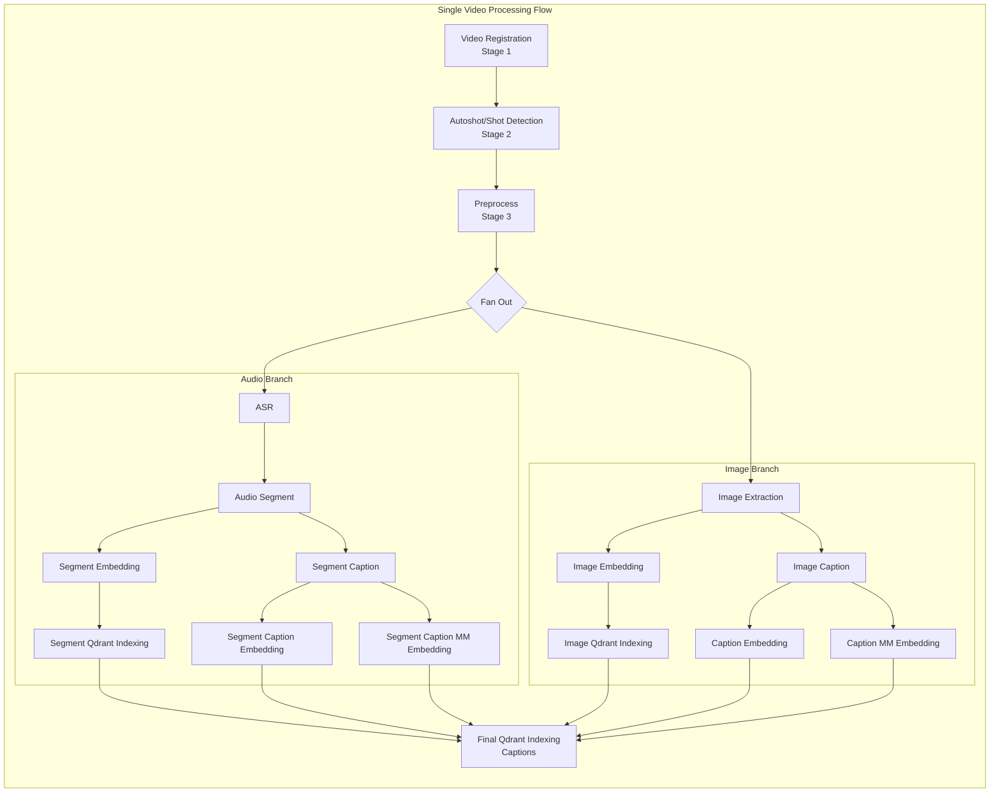

# CLAUDE.md

This file provides guidance to Claude Code (claude.ai/code) when working with code in this repository.

## Project Overview

This is a **Prefect-based video processing pipeline** that extracts, analyzes, and indexes video content for semantic search. The system processes uploaded videos through multiple stages: scene detection, audio transcription, frame extraction, captioning, embedding generation, and vector indexing.

### Tech Stack

- **Python 3.12+** with Pydantic v2 for data validation
- **Prefect 3.x** for workflow orchestration with DaskTaskRunner for parallelism
- **FastAPI** for the REST API layer
- **PostgreSQL** for artifact metadata and lineage tracking
- **MinIO** (S3-compatible) for object storage (videos, images, artifacts)
- **Qdrant** for vector search and embedding storage
- **Redis** for Prefect messaging
- **External ML Services**: QwenVL (embeddings), mmBERT (text embeddings), ASR, OCR, LLM providers

## Commands

### Development Setup

```bash
# Install with uv (recommended)
uv sync --extra worker

# Or with pip
pip install -e ".[worker]"
```

### Running Services

```bash
# Start all infrastructure (Prefect, Postgres, Redis, MinIO, Qdrant)
cd docker && docker-compose up -d

# Run the API server
video-pipeline-api
# Or directly:
uvicorn video_pipeline.api.app:app --host 0.0.0.0 --port 8050

# Run Prefect worker (after infrastructure is up)
prefect worker start --pool local-pool
```

### Linting and Testing

```bash
# Lint with ruff
ruff check src/
ruff format src/

# Run tests
pytest tests/
pytest tests/test_specific.py -v  # Single file with verbose output
```

## Architecture Overview

### Directory Structure

```
src/video_pipeline/
├── api/                    # FastAPI application
│   ├── app.py             # Main FastAPI app with CORS, routers
│   ├── lifespan.py        # Startup/shutdown lifecycle
│   └── routers/           # API endpoints (upload, health, videos)
├── config/                 # Configuration management
│   ├── settings.py        # Pydantic-settings based configuration
│   ├── tasks.yaml         # Task definitions with retries, timeouts, caching
│   └── environments/      # Environment-specific YAML configs (dev.yaml, etc.)
├── core/
│   ├── artifact/          # Pydantic models for pipeline outputs
│   ├── client/            # External service clients
│   │   ├── inference/     # ML service clients (ASR, OCR, Autoshot, Embeddings)
│   │   ├── llm_provider/  # LLM clients (Gemini, OpenRouter, Moondream)
│   │   ├── progress/      # HTTP progress tracking
│   │   └── storage/       # Storage clients (MinIO, Qdrant, PostgreSQL)
│   └── storage/           # Persistence layer (pg_tracker, prefect_block)
├── flow/                   # Prefect flow orchestration
│   ├── main.py            # Main single_video_processing_flow
│   ├── submain.py         # Alternative flow definitions
│   ├── subtask.py         # Preprocessing tasks
│   └── batch_helper.py    # Batching utilities
└── task/                   # Individual processing tasks
    ├── base/              # BaseTask abstract class and utilities
    ├── video/             # Video registration
    ├── autoshot/          # Scene/shot detection
    ├── asr/               # Audio speech recognition
    ├── audio_segment/     # Audio segmentation
    ├── image_extraction/  # Frame extraction
    ├── image_caption/     # Frame captioning
    ├── image_embedding/   # Frame embeddings
    ├── image_ocr/         # OCR on frames
    ├── segment_caption/   # Segment caption generation
    ├── segment_embedding/ # Segment embeddings
    └── qdrant_indexing/   # Vector database indexing
```

### Core Components

#### 1. Task System (`task/base/base_task.py`)

All tasks extend `BaseTask[InputT, OutputT]` and implement three methods:

```python
class MyTask(BaseTask[InputType, OutputType]):
    async def preprocess(self, input_data: InputT) -> Any:
        """Validate/transform input, load data, prepare batches."""
        pass

    async def execute(self, preprocessed: Any, client: Any) -> Any:
        """Core processing logic (calls external services, models)."""
        pass

    async def postprocess(self, result: Any) -> OutputT:
        """Create artifacts, persist to storage."""
        pass

    @staticmethod
    async def summary_artifact(final_result: OutputT) -> None:
        """Create Prefect artifact summary."""
        pass
```

Task configuration is loaded from `config/tasks.yaml`:

```python
config = TaskConfig.from_yaml("task_name")
kwargs = config.to_task_kwargs()  # Converts to Prefect @task decorator kwargs
```

#### 2. Artifacts (`core/artifact/artifact.py`)

Pydantic models representing pipeline outputs with lineage tracking:

- `VideoArtifact` - Initial video metadata (fps, duration, format)
- `AutoshotArtifact` - Scene boundary detection results
- `ASRArtifact` - Audio transcription results
- `AudioSegmentArtifact` - Semantically segmented audio chunks
- `ImageArtifact` - Extracted video frames
- `ImageCaptionArtifact` / `ImageEmbeddingArtifact` / `ImageOCRArtifact` - Frame analysis
- `SegmentCaptionArtifact` / `SegmentEmbeddingArtifact` - Segment analysis
- Various embedding artifacts for vector search

Each artifact has:
- `artifact_id` - Unique identifier (UUID)
- `user_id` - Owner reference
- `lineage_parents` - Parent artifact IDs for tracking data flow
- `object_name` - MinIO storage path

#### 3. Flow Orchestration (`flow/main.py`)

The main flow `single_video_processing_flow` orchestrates the complete pipeline:



#### 4. Configuration (`config/settings.py`)

Settings use Pydantic-settings with environment variable overrides:

```python
# Access settings
from video_pipeline.config import get_settings

settings = get_settings()
settings.minio.endpoint  # MinIO endpoint
settings.postgres.connection_string  # PostgreSQL connection URL
settings.qdrant.host  # Qdrant host
settings.dask.to_cluster_kwargs()  # Dask cluster config
```

Environment-specific YAML configs in `config/environments/{env}.yaml`:
- Set `APP_ENV=dev|staging|prod` to load the appropriate config
- Environment variables take precedence over YAML values

#### 5. Storage Clients

- **MinIO** (`core/client/storage/minio/client.py`): S3-compatible object storage for videos, images, artifacts
- **PostgreSQL** (`core/client/storage/pg/`): Artifact metadata and lineage
- **Qdrant** (`core/client/storage/qdrant/`): Vector database for embeddings

### Key Infrastructure (docker-compose)

| Service | Port | Purpose |
|---------|------|---------|
| Prefect Server | 4200 | Workflow orchestration UI |
| Prefect Worker | 8787 | Dask dashboard |
| MinIO | 9000/9001 | Object storage (API/Console) |
| Qdrant | 6333/6334 | Vector database |
| PostgreSQL | 5432 | Artifact metadata |
| Redis | 6379 | Prefect messaging |
| ArangoDB | 8529 | Graph database (optional) |
| Video Pipeline API | 8050 | REST API |

### API Endpoints

```
GET  /                           # Service info
GET  /docs                       # OpenAPI documentation
POST /api/uploads/               # Submit videos for processing
GET  /api/health                 # Health check
GET  /api/health/prefect         # Prefect connectivity check
DELETE /api/videos/{video_id}    # Delete video and associated artifacts
```

### Data Flow

Each stage produces typed artifacts that become inputs to downstream tasks, with lineage tracked via `artifact_id` references. The `lineage_parents` property enables tracing the origin of any artifact back to the source video.

### Task Configuration (tasks.yaml)

Each task has:
- `name`, `description`, `stage` - Metadata
- `retries`, `retry_delay_seconds`, `timeout_seconds` - Execution controls
- `cache_enabled`, `cache_expiration_seconds`, `cache_key_fn` - Caching
- `additional_kwargs` - Task-specific parameters (model URLs, batch sizes)

### External ML Services

The pipeline depends on these external services (configured in tasks.yaml):

- **Autoshot**: Scene detection model (`http://autoshot`)
- **ASR (Qwen3-ASR)**: Speech recognition (`http://qwen3-asr:80/v1`)
- **QwenVL Embedding**: Visual embeddings (`http://qwen_vl_embedding:8080/embedding`)
- **mmBERT**: Text embeddings (`http://mmbert:8000`)
- **OCR (LightON)**: Text extraction from images (`http://ocr_lighton:8000`)
- **OpenRouter**: LLM API for captions (various models)

## Development Guidelines

### Adding a New Task

1. Create a new directory under `task/` with `main.py` and `helper.py` (if needed)
2. Extend `BaseTask[InputT, OutputT]` and implement the four required methods
3. Add configuration to `config/tasks.yaml`
4. Register the task in the flow (`flow/main.py`)
5. Create corresponding artifact type if needed in `core/artifact/artifact.py`

### Adding a New Artifact

1. Add the Pydantic model in `core/artifact/artifact.py` extending `BaseArtifact`
2. Implement `_build_lineage_parents()` to track data lineage
3. Update `ArtifactPersistentVisitor` in `core/storage/pg_tracker.py` if persistence is needed

### Configuration Changes

1. Update `config/settings.py` for new settings classes
2. Add environment-specific values to `config/environments/{env}.yaml`
3. Document new environment variables

### Testing

Currently no test suite is present. When adding tests:
- Place tests in a `tests/` directory at the project root
- Use `pytest` with `pytest-asyncio` for async tests
- Mock external services (MinIO, Qdrant, ML services)